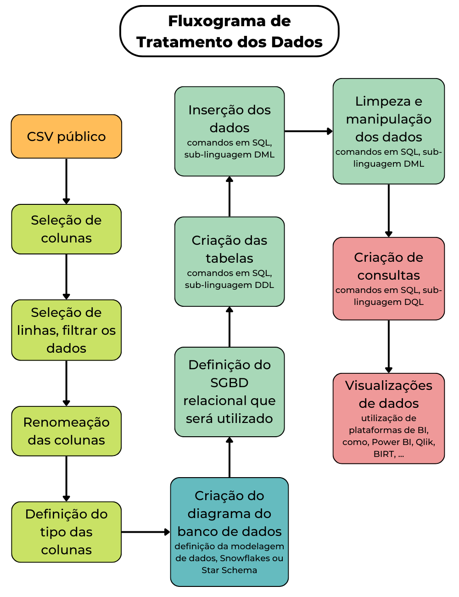

# pucminas-projeto1
Projeto: Desenvolvimento de Aplicação para Tratamento de Dados - 2022/02
 
1º projeto da graduação Banco de Dados - PUC Minas
  

## O custo benefício da gasolina e do etanol no Brasil: uma análise da série histórica de preço dos combustíveis

### 1. Introdução

A base de dados definida retrata uma série histórica de preços de combustíveis praticados por diversos postos no Brasil e permite analisarmos as diferentes opções de produtos e seus respectivos preços.
  
A partir dos dados disponibilizados pela Agência Nacional do Petróleo, Gás Natural e Biocombustíveis (ANP), realizaremos o levantamento dos preços praticados por revendedores de gasolina e etanol, por estado, em 2020 e 2021. Diante disso, será realizada uma análise da variação de preços praticados semanalmente entre os diferentes tipos de combustíveis, buscando as melhores condições de compra destes recursos.
  
Quando compensa usar um combustível no lugar do outro? Qual a variação do preço dos combustíveis nos estados? No próprio estado, há diferenças significativas de preços dos combustíveis entre os postos? Quais bandeiras tem preços mais acessíveis? Essas são algumas das perguntas que conseguiremos responder quando for realizado uma análise mais detalhada dessa base de dados e, obtendo essas informações, empresas que possuem frotas podem traçar estratégias que podem reduzir custos.

### 2. Descrição das Bases de Dados Utilizadas

Os dados analisados são da Agência Nacional do Petróleo, Gás Natural e Biocombustíveis (ANP), disponíveis no portal brasileiro de dados abertos do governo. Segundo a definição da Open Knowledge Brasil, os dados abertos são dados que podem ser livremente usados, reutilizados e redistribuídos por qualquer pessoa - sujeitos, no máximo, à exigência de atribuição da fonte e compartilhamento pelas mesmas regras.

Conforme o art. 8º da LAI (Lei de Acesso à Informação), é dever dos órgãos e entidades públicas promover, independentemente de requerimentos, a divulgação em local de fácil acesso, no âmbito de suas competências, de informações de interesse coletivo ou geral por eles produzidas ou custodiadas

As bases de dados utilizadas acompanham os preços praticados por revendedores de combustíveis automotivos, distribuídos por todas as regiões do Brasil, por meio de uma pesquisa semanal de preços realizada.

O conjunto de dados trabalhado está no formato .csv (comma-separated values), os quais são arquivos de texto de formato regulamentado pelo RFC 4180, que faz uma ordenação de bytes ou um formato de terminador de linha, separando valores com vírgulas.

O conjunto de dados está disponível no site <https://dados.gov.br/dataset/serie-historica-de-precos-de-combustiveis-por-revenda>, tendo sido acessado no dia 25 de agosto de 2022.

### 3. Fluxograma

O fluxograma abaixo evidencia as operações e definições que foram adotadas para o tratamento dos dados previsto no projeto, dessa forma permitindo a fácil identificação de todas as etapas do processo, bem como quando cada etapa deverá acontecer. A diferença entre as cores dos processos representa o agrupamento das atividades a serem realizadas nas diferentes etapas, e a respectiva sequência das atividades.

### 4. Limpeza e Transformação

Todas as limpezas e transformações nos dados foram realizadas antes da captura de dados, isto porque a forma de escrita dos dados nas tabelas será por meio do comando, em SQL, `load data infine`, comando esse que pega todos os dados de um documento, no nosso caso um csv, e preenche a tabela especificada, por isso é muito importante e necessário que os dados já estejam tratados, a fim de não ocasionar erros na escrita. 

As tratativas nos dados foram feitas através da linguagem de programação Python, especificamente a biblioteca Pandas, é possível encontrar todas as tratativas em `etapa4_limpeza_e_transformacao.py` no repositório.

### 5. Captura dos Dados

O SGBD relacional escolhido foi o MySQL e por meio dele foram realizados os comandos necessários para criação do banco de dados, criação das tabelas e, finalmente, inserção dos dados através da importação do arquivo csv para as tabelas criadas.

Os comandos utilizados para tais operações podem ser encontrados em `etapa5_captura_dos_dados.sql` no repositório.

### 6. Visualização dos Dados

A fim de responder perguntas feitas no início do projeto, como - qual a variação de preço dos combustíveis nos diferentes estados do Brasil, quais combustíveis têm maiores médias de preços, quais combustíveis são mais consumidos, etc - o grupo criou gráficos e outros tipos de visualizações.

Estas visualizações de dados foram feitas através da linguagem de programação Python, sendo necessária a utilização das bibliotecas:
<ol>
  <li> mysql.connector - biblioteca usada para conectar o python no mysql, SGBD relacional usado pelo grupo para criação e inserção de dados nas tabelas;</li>
  <li> pandas - biblioteca usada para criação de dataframes, eles serão necessários para criação dos gráficos;</li>
  <li> plotly.express - biblioteca utilizada na criação dos gráficos.</li>
</ol>

Todo processo de criação das visualizações de dados pode ser encontrado em `etapa6_visualizacao_dos_dados.ipynb` no repositório.
